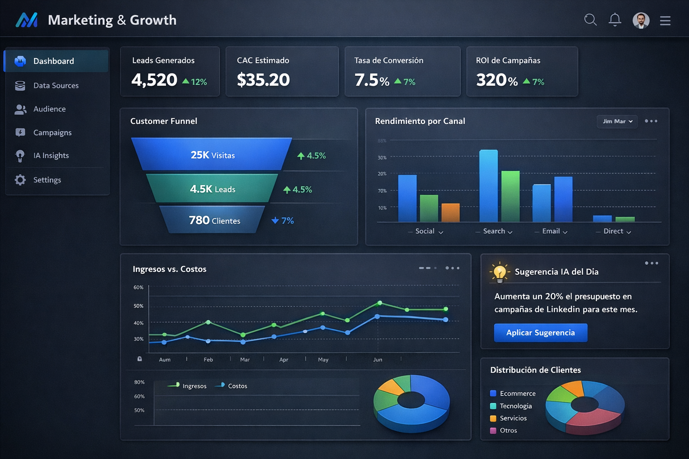
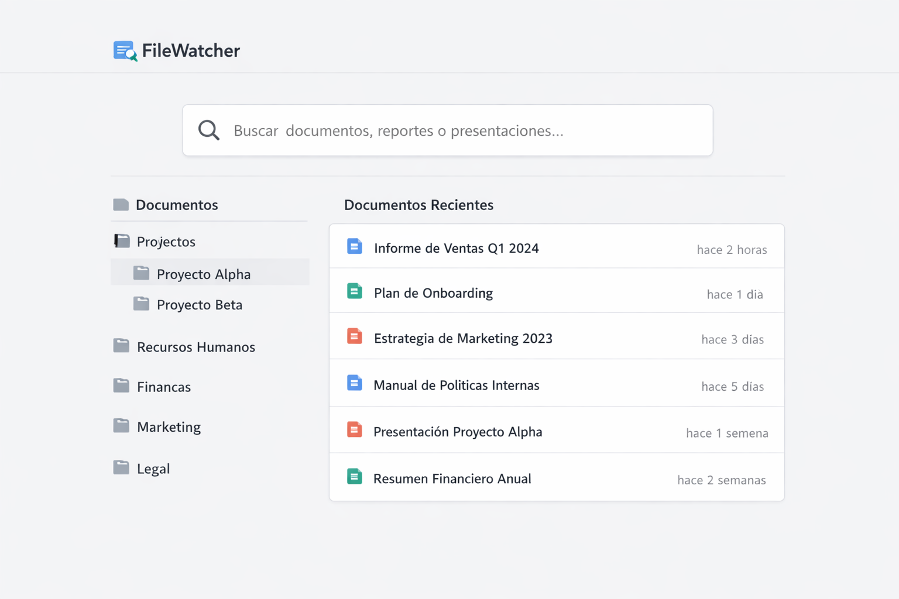
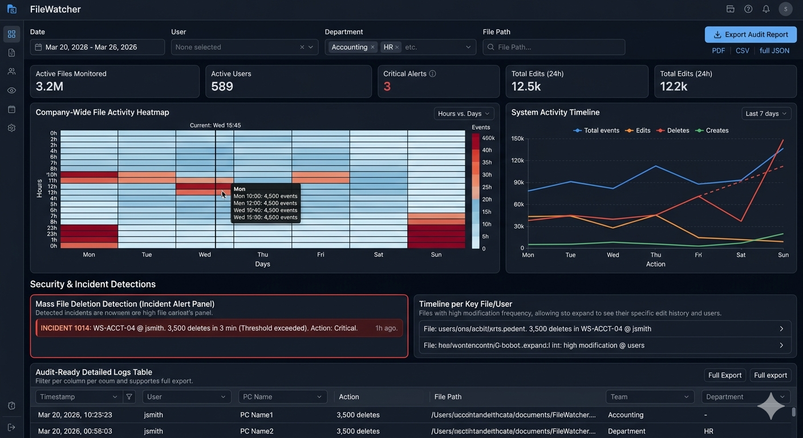
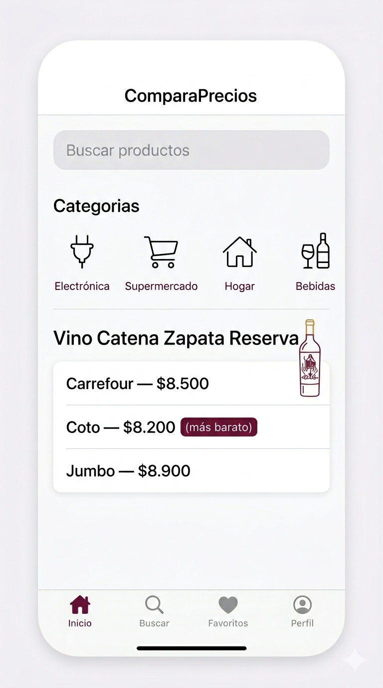

# Propuestas de desarrollo

# 📈 Marketing & Growth

## Plataforma de marketin integral:
agarra datos de web , redes sociales
identifica clientes
ofrece sugerencias de anuncios personalizados.

## 4 partes:
Plataforma de Marketing (ui/ux).
Extraccion de datos.
procesameinto de los datos.
Generacion de sugerencias en la app (integradcion de modelos de IA)

- Cliente potencial : empresas mediana y grandes que utilicen medios digitales.

### pros:
- le interesa a Alejandro Vazquez, mariana sozzi, Patricia Jebsen y Federico Rolando.

### cons:
- Es dificil hacer una integracion con todo y traerte todos los datos. 
- Tendriasmos que conseguir una cuenta para experimentar.

# 🤖 Automatización & IA

## FileWatcher — Sistema de gestion knowledge de empresas
Sistema para ordenar y evaluar las contribuciones de cada persona a una base de documentos.

## Pain points que resuelve:
- En empresas con servidores de archivos compartidos no hay visibilidad de actividad.
- Imposible saber quién editó un archivo sin auditoría manual.
- No existe forma simple de ver patrones de trabajo por equipo. Util para impllementar AI a nivel de empresa.
- Útil para RRHH, gerencia y auditorías internas.

### Features posibles:
- Timeline de modificaciones por archivo.
- Heatmap de actividad por hora/día/usuario.
- Exportación de reportes para auditoría.
- Detección de eliminación masiva de archivos (alerta de posible incidente).

# 💳 Fintech & Finanzas Inteligentes

APP para recopilar precios de cosa y comprar el mas barato.

### consultar

colateral para compra de acciones con activos

o directamente apalancamiento del 100% como hacen empresas de afuera.

*Última actualización: sesión de brainstorm HackITBA 2026*
